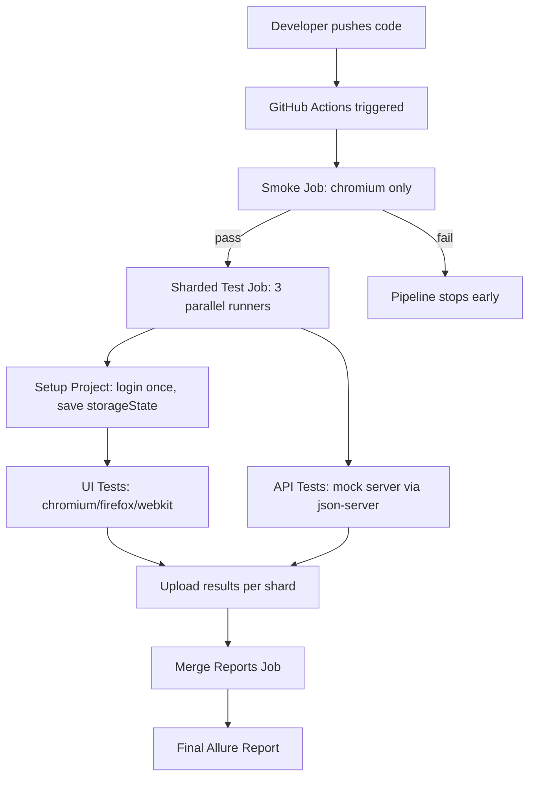

# Playwright QA Flagship Project


## Overview
End-to-end + API test automation flagship project — built to demonstrate 
senior QA/SDET skills using Playwright + TypeScript.

## Tech Stack
- Playwright (E2E + API testing)
- TypeScript with path aliases
- Page Object Model + custom fixtures
- Docker + Docker Compose
- GitHub Actions CI/CD (sharding, smoke gate, caching)
- Allure Reporting

## Project Structure
```
tests/
├── ui/        # UI end-to-end tests
└── api/       # API tests
src/
├── data/        # Test data (JSON)
├── fixtures/    # Custom test fixtures
├── pages/       # Page Object Models
└── setup/       # storageState for auth session reuse
.github/workflows/  # CI pipeline
```

## Architecture

This project uses a two-stage CI pipeline: a fast smoke check (Chromium only) 
gates the full sharded regression suite. Authentication is handled once via 
a setup project (`storageState`), then reused across all UI tests. Results 
from all shards are merged into a single Allure report.



## Running Tests
```
npm test                  # all tests
npm run test:smoke        # smoke tests only
npm run test:api          # API tests with mock server
docker-compose up --build # full containerized run
```

## Roadmap
- [x] Project scaffold + CI setup
- [x] E2E test suite + POM + fixtures
- [x] API testing layer
- [x] Docker containerization
- [x] Allure reporting + CI polish (caching, sharding, smoke gate)
- [x] Auth session reuse (storageState)
- [x] Architecture documentation

## Status
✅ Completed
This project demonstrates a production-grade Playwright + TypeScript flagship 
covering E2E testing, API testing, CI/CD, containerization, and reporting. 

## Known Limitations
- The local mock API (`json-server`) uses synchronous file writes and can 
  occasionally show transient connection issues under high parallel load. 
  Mitigated via `retries: 2` on the API test project — this is a known 
  trade-off of using a lightweight mock server rather than a production database.